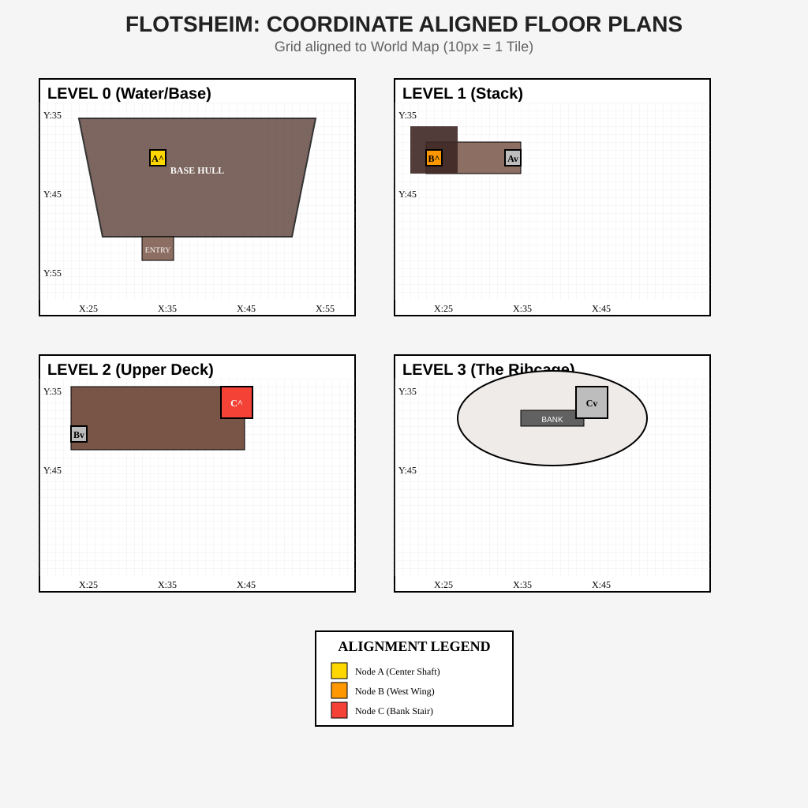
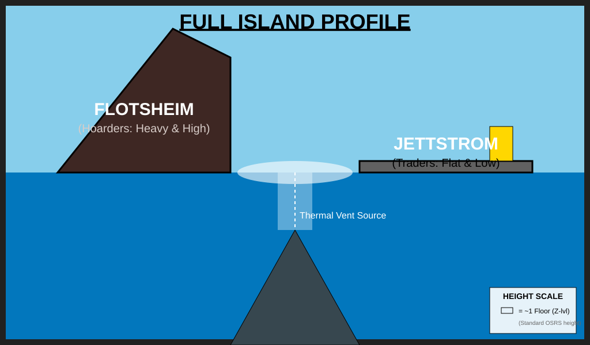
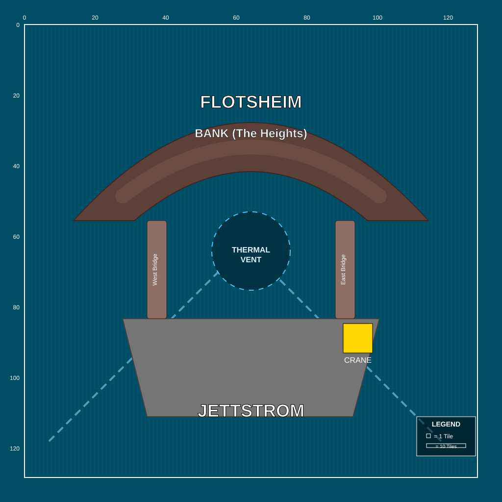
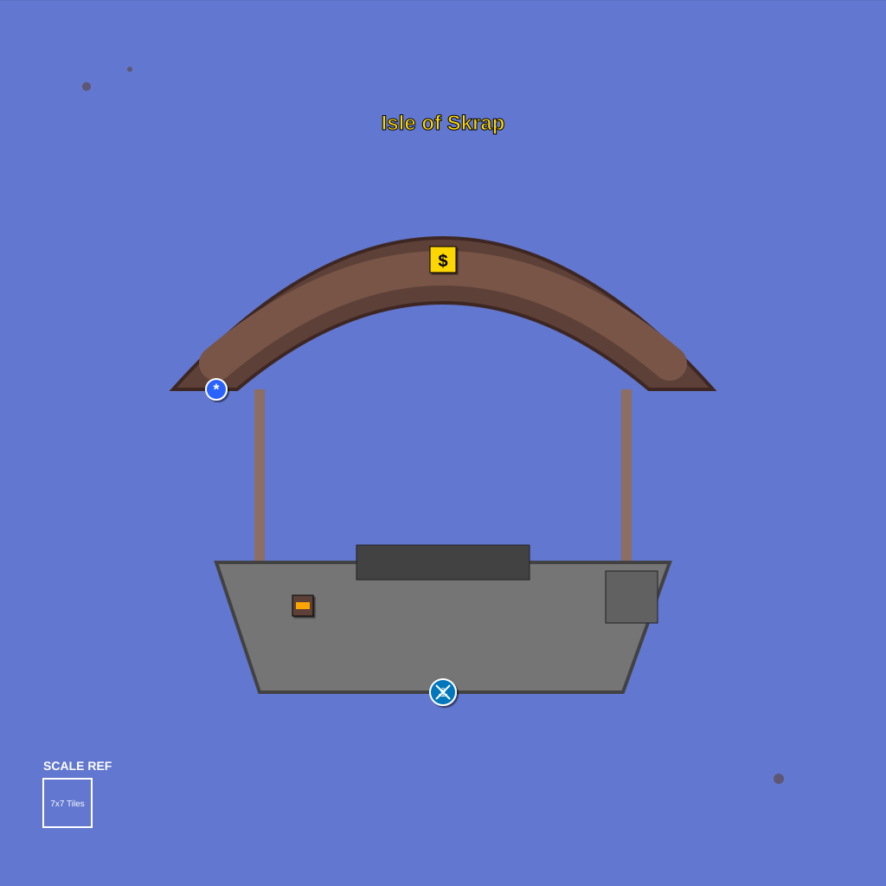

# Isle of Skrap

An unpublished island design for Jagex's Player Designed Island Competition (Old School RuneScape, Sailing, announced 11 December 2025).

This repo is the archive. I built it in Cursor in December 2025 and never emailed or posted the files. MIT license: reuse is welcome, including commercially, with attribution. Jagex may use, adapt, and ship any of this for Old School RuneScape without further permission.

## Why this is public

On 14 September 2026 Jagex posted [The Graveyard - Rewards](https://osrs.game/Graveyard-Rewards): a Fremennik island, an underwater cavern of shipwrecks, and an agility course through half-sunken wrecks.

Skrap sits in a similar neighborhood of ideas (Fremennik, wreckage, water, agility). It is not the same island. What is unique here is the split floating platforms, the ballast-versus-buoyancy feud, and the Recycler. I never submitted these files. Parallel design is the simplest explanation. I am publishing the work so the dates are public, and so Jagex (or anyone else) can take ideas from it if they want them.

The shortest complete pitch is [v2/lore.md](v2/lore.md) (why the two clans need each other) and [v2/quest.md](v2/quest.md) (*The Sinking Feeling*).

## The island

**Isle of Skrap** is a floating junk hub in the Northern Sea. Two Fremennik factions live on platforms tethered over a hydrothermal vent:

- **Floatsheim** (west): the hoarders. They provide the ballast.
- **Jettstrom** (east): the traders. They provide the buoyancy.

They dislike each other and still cannot survive alone. The bank sits in a leviathan ribcage. Utility includes a Recycler (break metal items down at a loss), steam cooking at the vent, and an agility route through the wreckage.

## How to read this repo

| File | What it is |
| --- | --- |
| [v2/submission_final.md](v2/submission_final.md) | Short pitch |
| [v2/lore.md](v2/lore.md) | Clans, vent, and co-dependency |
| [v2/quest.md](v2/quest.md) | Quest walkthrough |
| [v2/blueprints/Master_Blueprint_Full_Island.svg](v2/blueprints/Master_Blueprint_Full_Island.svg) | 128x128 master layout |
| [FILE_LOG.md](FILE_LOG.md) | Created and last-modified timestamps |
| [evidence/cursor-usage-2025-12-11-17.png](evidence/cursor-usage-2025-12-11-17.png) | Cursor token usage, 11-17 Dec 2025 |
| [v1/comp.md](v1/comp.md) | Saved copy of the competition post (not my writing) |

**v1 (11 Dec 2025)** is sketches and a first draft. Those drawings look more like the game.

**v2 (17 Dec 2025)** is the polished writeup: lore, quest, NPCs, and blueprint layouts. Clearer design, less illustration.

## Gallery

### v2 blueprint

West Floatsheim, east Jettstrom, steam vent in the gutter. The bank is labeled **BANK (Leviathan Ribs)**. 128x128 tiles.

### v1 sketches

Flotsheim floor plans. Level 3 is the bank inside the ribcage.

Full island profile. Hoarders high on the left, traders flat on the right, vent in the middle.

Top-down map. Bank on the heights, Jettstrom docks below, thermal vent in the center.

Minimap-style preview.

## File map

### v1

- [submission_draft.md](v1/submission_draft.md)
- [production_plan.md](v1/production_plan.md)
- [scratchpad.md](v1/scratchpad.md)
- [comp.md](v1/comp.md) (competition post copy)
- [world_map.png](v1/world_map.png) (large OSRS reference map)

Sketches: [1.1 Map](v1/sketches/Sketch_1.1_Map_Overview.svg) · [1.2 Flotsheim section](v1/sketches/Sketch_1.2_Flotsheim_Section.svg) · [1.3 Jettstrom docks](v1/sketches/Sketch_1.3_Jettstrom_Docks.svg) · [1.4 Side profile](v1/sketches/Sketch_1.4_Full_Side_Profile.svg) · [1.5 Floors](v1/sketches/Sketch_1.5_Flotsheim_Floors.svg) · [1.6 Minimap](v1/sketches/Sketch_1.6_Minimap_Preview.svg) · [2.1 Recycler](v1/sketches/Sketch_2.1_Recycler_Interface.svg) · [2.2 Contract board](v1/sketches/Sketch_2.2_Contract_Board.svg) · [3.1 NPCs](v1/sketches/Sketch_3.1_NPC_Concepts.svg)

### v2

- [submission_final.md](v2/submission_final.md)
- [design_doc.md](v2/design_doc.md)
- [lore.md](v2/lore.md)
- [quest.md](v2/quest.md)
- [npcs.md](v2/npcs.md)

Blueprints: [Master](v2/blueprints/Master_Blueprint_Full_Island.svg) · [L0 Floatsheim](v2/blueprints/blueprint_L0_Floatsheim.svg) · [L1 Jettstrom](v2/blueprints/blueprint_L1_Jettstrom.svg) · [L-1 Vent](v2/blueprints/blueprint_L_minus_1_Vent.svg)

### Other

- [FILE_LOG.md](FILE_LOG.md)
- [evidence/](evidence/) (Cursor usage screenshot)
- [LICENSE](LICENSE)
